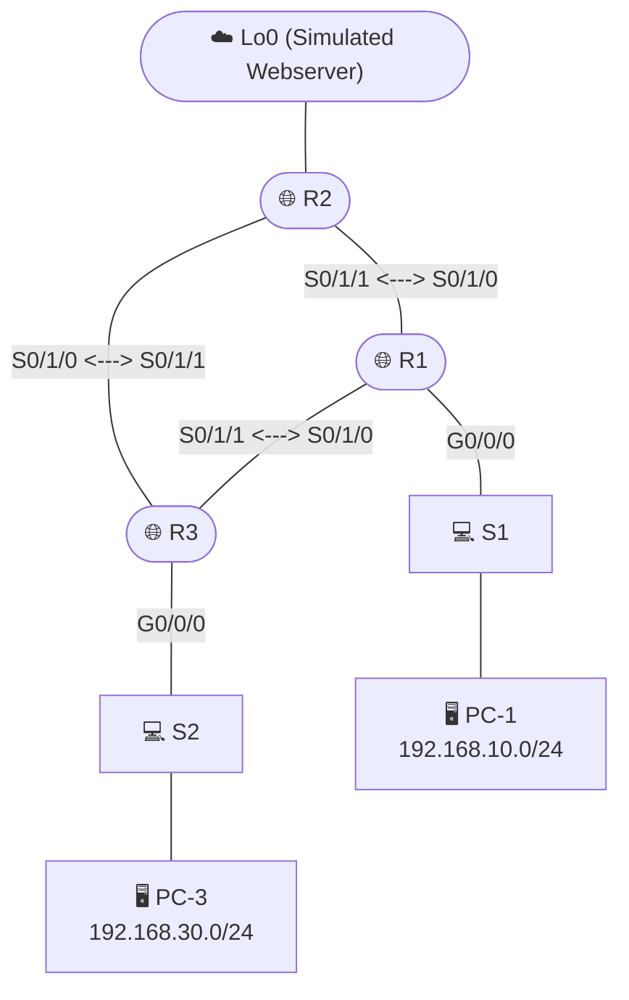

# Lab 1 — Single-Area OSPFv2 & ACL Network Security

## Objective

Stand up a single-area OSPFv2 routing domain across three routers, tune OSPF behavior (metric reference bandwidth, passive interfaces, authentication), then layer in standard and extended ACLs to enforce specific traffic policies between LANs.

R1, R2, and R3 form a triangle over serial links — R2 sits at the "core" with a loopback simulating an internet-facing webserver; R1 and R3 are the branch routers carrying the actual user LANs.

## Addressing Table

| Device | Interface | IP Address | Subnet Mask |
|---|---|---|---|
| R1 | G0/0/0 | 192.168.10.1 | 255.255.255.0 |
| | S0/1/0 (DCE) | 10.1.1.1 | 255.255.255.252 |
| | S0/1/1 | 10.1.3.1 | 255.255.255.252 |
| R2 | Lo0 | 209.165.200.225 | 255.255.255.224 |
| | S0/1/1 | 10.1.1.2 | 255.255.255.252 |
| | S0/1/0 (DCE) | 10.1.2.1 | 255.255.255.252 |
| R3 | G0/0/0 | 192.168.30.1 | 255.255.255.0 |
| | S0/1/1 | 10.1.2.2 | 255.255.255.252 |
| | S0/1/0 (DCE) | 10.1.3.2 | 255.255.255.252 |
| PC-1 | NIC | 192.168.10.11 | 255.255.255.0 |
| PC-3 | NIC | 192.168.30.33 | 255.255.255.0 |
| WebServer | at R2 (Lo0) | 209.165.200.225 | 255.255.255.224 |

OSPF process ID 1 (locally significant only), area 0, router IDs 1.1.1.1 / 2.2.2.2 / 3.3.3.3 for R1/R2/R3.

## Approach

### Part 1 — OSPFv2 fundamentals

**Wildcard masks, not subnet masks.** OSPF `network` statements take a wildcard mask — the bitwise inverse of a subnet mask — so a /24 (255.255.255.0) becomes wildcard 0.0.0.255, and a /30 (255.255.255.252) becomes 0.0.0.3. Every `network` line in the configs below uses this inverted form deliberately, not as a typo.

**One thing intentionally NOT advertised.** R2's loopback (the simulated webserver at 209.165.200.225) is deliberately excluded from OSPF advertisement. This isn't an oversight — the lab specifically calls for hiding the internet-facing network from internal dynamic routing, which mirrors a real design pattern: routers don't blindly advertise every interface into an internal routing protocol, especially ones representing external-facing infrastructure. The cost is that R2's own loopback subnet then needs a different mechanism (a default route, covered below) to remain reachable.

**Passive interfaces, for a security reason, not just traffic reduction.** R1's LAN-facing interface (G0/0/0) is marked `passive-interface`, which stops R1 from sending OSPF Hello packets out onto that LAN. The lab instructions present this as a traffic-reduction technique, but there's a real security angle too: an OSPF Hello broadcasting onto an access-layer LAN is an open invitation for any device plugged into that LAN to attempt to form an OSPF neighbor relationship and inject false routes. A passive interface still gets advertised as a network *inside* OSPF — it just never sends or receives OSPF protocol traffic on that wire, so end hosts on the LAN have zero ability to interact with the routing protocol at all.

**OSPF MD5 authentication on the inter-router link.** Configured globally per-area (`area 0 authentication message-digest`) and then per-interface (`ip ospf message-digest-key 1 md5 <key>`) on the link between neighbors. This stops a rogue device from forming a bogus OSPF adjacency over that link and injecting forged routes — the key thing to understand is that authentication is mutual and per-link: both ends need matching keys, and it's the interface-level key, not the area-level statement alone, that actually protects the wire.

**Default route, originated and redistributed.** R2 (sitting closest to "the internet" via its loopback) gets a static default route pointing out Lo0, and then `default-information originate` injects that default route into OSPF so R1 and R3 learn it automatically rather than needing their own manually configured defaults. This is the standard pattern for a hub router that has external connectivity feeding a purely internal OSPF domain.

### Part 2 — OSPF metric tuning

**Why the default reference bandwidth matters.** OSPF's link cost is `reference bandwidth ÷ link bandwidth`, with a default reference bandwidth of 100 Mbps. Anything 100 Mbps or faster (Fast Ethernet, Gigabit, 10G) all collapses to a cost of 1 under the default — meaning OSPF literally cannot tell a Gigabit link from a Fast Ethernet link unless the reference bandwidth is raised. `auto-cost reference-bandwidth 1000` was applied identically on **all three routers** (R1, R2, R3) — a deliberately consistent change, since reference bandwidth is a purely local calculation setting and mismatched values across routers would produce inconsistent costs for the same physical links, breaking the assumption that OSPF cost is symmetric.

**Manual cost override for a single link.** Beyond the global reference-bandwidth change, `ip ospf cost 31250` was applied directly on the R1↔R3 serial link to make that specific path artificially expensive — independent of its actual bandwidth. This is the practical tool an administrator reaches for when a perfectly fast link still shouldn't be preferred (cost reasons, provider SLAs, deliberately routing traffic via a specific path for monitoring or compliance) — confirmed by re-running `traceroute` from PC-1 to PC-3 before and after the cost change and watching the path actually shift.

### Part 3 — ACL design

**Placement strategy: as close to the source as possible.** Both extended ACLs in this lab follow the standard best practice — filter traffic nearest to where it originates, so unwanted packets get dropped before consuming bandwidth or router resources further along the path, rather than letting them traverse the whole network only to be discarded at the destination edge.

**Numbered vs. named ACLs.** ACL 100 on R1 is a numbered extended ACL (the 100–199 range is reserved for extended ACLs; 1–99 for standard). The R3 policy uses a *named* ACL (`WEB-POLICY`) instead — functionally identical to a numbered ACL, but named ACLs support inserting and removing individual lines by sequence number without rewriting the whole list, which matters once an ACL needs to be edited in place (see the ICMP addition below) rather than rebuilt from scratch.

**What each ACL actually permits, read top-to-bottom — explicit deny-any-any implied.** Every Cisco ACL ends with an implicit `deny any any` even if it's never typed. ACL 100 on R1 permits: ICMP echo-reply traffic into the 192.168.10.0/24 network (so replies can return), HTTP from anywhere to 192.168.10.0/24, HTTPS to 192.168.1.0/24, and a Telnet range from one specific host to one specific host (PC-1 to R3's serial interface) — everything else hitting that interface in that direction is silently dropped by the implicit deny.

**Editing an ACL in place by sequence number, instead of rebuilding it.** When the requirement changed to "also allow ICMP ping between the two LANs," new lines were inserted at specific sequence numbers (`30 permit icmp ...`, `40 permit icmp ...`) on both R1's ACL 100 and R3's WEB-POLICY — rather than deleting and recreating the ACL. This only works because both ACLs were defined with sequence-numbered entries from the start, which is itself a reason to prefer building ACLs with explicit sequence gaps (10, 20, 30...) rather than letting the router auto-number sequentially with no room to insert later.

## Verification & key findings

- `show ip ospf neighbor` confirmed each router only saw the neighbors it has a direct physical link to — R1 and R3 are *not* direct OSPF neighbors of each other in the topology sense, but they exchange routes through R2 once OSPF converges.
- `show ip route` on R1 showed all networks reachable except R2's loopback, exactly as intended by withholding that network from advertisement — confirming the omission was working as designed, not failing silently.
- After raising the reference bandwidth to 1000 and applying a manual cost override on the R1–R3 link, the OSPF metric for 192.168.30.0/24 changed measurably from its default-bandwidth value, and a fresh `traceroute` confirmed traffic actually rerouted via R2 instead of the direct R1–R3 serial link — cost manipulation isn't just a number in a routing table, it changes real packet paths.
- `show access-lists` after applying ACL 100 confirmed an explicit deny was *not* manually added — relying on the implicit `deny any any` that closes every Cisco ACL, since policy 1–2 only needed to permit specific traffic and silently drop the rest.
- Telnet from PC-1 to R3's serial interface succeeded (matching the explicit permit), while Telnet from PC-1 to R2 failed (correctly caught by the implicit deny, since no rule permits it).
- Web access tests on R3's WEB-POLICY confirmed PC-3 could reach R1's webserver over HTTP but was blocked from any other network's webserver — exactly the asymmetric policy the lab required (192.168.30.0/24 can reach 192.168.10.0/24's webserver, nothing else).

## Reflection

- **Standard ACLs filter only on source IP address** — they have no visibility into destination address, protocol, or port, which limits them to coarse "this whole source network can/can't pass" decisions.
- **Extended ACLs filter on source AND destination IP, protocol, and port/service** — letting policy be as specific as "only HTTP from this network to that network," which is what made the layered web/Telnet/ICMP policies in this lab possible at all.
- **OSPF link cost calculation:** `reference bandwidth ÷ link bandwidth`, minimum value of 1, and the result for a path is the sum of every link's cost along the route to the destination.

## Files

- [`r1-config.txt`](./r1-config.txt) — Router R1 (OSPF, passive interface, ACL 100, manual cost)
- [`r2-config.txt`](./r2-config.txt) — Router R2 (OSPF, MD5 authentication, default route origination, loopback withheld)
- [`r3-config.txt`](./r3-config.txt) — Router R3 (OSPF, named ACL WEB-POLICY, manual cost)
