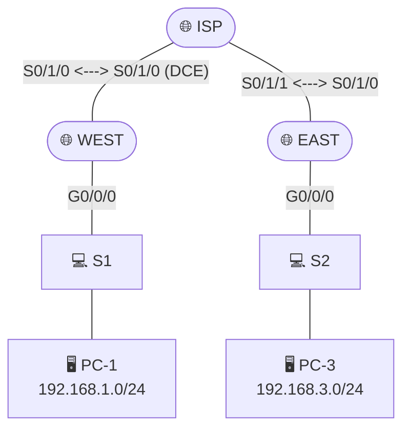

# Lab 2 — NAT/NAPT, PPP WAN Authentication & GRE VPN Tunnel

## Objective

Three independent WAN/edge technologies on the same WEST–ISP–EAST topology: translate private addresses to public ones (NAT/NAPT), authenticate a point-to-point WAN link (PPP + CHAP), then build an encrypted-adjacent overlay path (GRE tunnel) and route over it.

ISP also hosts a loopback (Lo1) simulating a public-facing webserver, and acts as the simulated "internet" both WEST and EAST default-route toward.

## Addressing Table

| Device | Interface | IP Address | Subnet Mask |
|---|---|---|---|
| WEST | G0/0/0 | 192.168.1.1 | 255.255.255.0 |
| | S0/1/0 | 209.165.201.18 | 255.255.255.252 |
| ISP | S0/1/0 (DCE) | 209.165.201.17 | 255.255.255.252 |
| | S0/1/1 (DCE) | 209.165.203.21 | 255.255.255.252 |
| | Lo1 (Webserver) | 209.165.200.225 | 255.255.255.224 |
| EAST | G0/0/0 | 192.168.3.1 | 255.255.255.0 |
| | S0/1/0 | 209.165.203.22 | 255.255.255.252 |
| PC-1 | NIC | 192.168.1.3 | 255.255.255.0 |
| PC-3 | NIC | 192.168.3.3 | 255.255.255.0 |

GRE tunnel (Lab Task 3 variant): WEST Tunnel0 = 172.16.12.1/30, EAST Tunnel0 = 172.16.12.2/30.

## Approach

### Part 1 — NAT and NAPT

**Why static NAT alone doesn't scale.** The lab opens by configuring a one-to-one static NAT mapping (one private IP ↔ one public IP) and then asks directly why this doesn't solve translation for the whole network — the answer is structural: a static mapping is exactly that, static and singular. Every additional private host that needs outbound connectivity would need its own dedicated public IP and its own static mapping line, which doesn't scale and defeats the entire point of address conservation that NAT exists to provide in the first place.

**Dynamic NAPT (overload) is the real-world default.** The actual deployed solution: a standard ACL identifies which private addresses are eligible for translation (`access-list 1 permit 192.168.1.0 0.0.0.255`), then `ip nat inside source list 1 interface s0/1/0 overload` maps *all* of those addresses to the router's single outside interface IP, using port numbers to keep multiple simultaneous private-host sessions distinguishable on the one shared public address. This is NAPT (Network Address and Port Translation) — what most home and small-office routers actually run, branded simply as "NAT."

**`ip nat inside` / `ip nat outside` is what actually activates translation.** Defining the NAT rule alone does nothing — the router also needs to be told which interface faces the private network (`ip nat inside`, applied to G0/0/0) and which faces the public network (`ip nat outside`, applied to the WAN-facing serial interface). Without this interface-level marking, the NAT rule exists in configuration but never triggers, since the router has no way to know which direction "inside" and "outside" actually are.

**Why ICMP gets a port number in the translation table at all.** ICMP has no concept of a port — yet the NAT translation table for a ping still shows a "port-like" number. Cisco IOS NAPT uses the ICMP query identifier field as a substitute port number purely so multiple simultaneous ICMP conversations (e.g. two pings from two different inside hosts) remain distinguishable in the translation table, even though ICMP itself has no native port concept the way TCP/UDP do.

### Part 2 — PPP with CHAP authentication

**HDLC is the silent default — until it isn't.** Cisco serial interfaces use HDLC encapsulation out of the box; nothing about a fresh serial link announces this unless you check `show interfaces serial <id>` directly. Switching to `encapsulation ppp` is a deliberate choice made because PPP supports authentication, multilink, and richer link-quality features that HDLC (a much simpler, Cisco-proprietary framing protocol) does not.

**CHAP over PAP, and why the difference actually matters.** PAP sends the password across the wire in clear text during authentication — anyone capturing traffic on that link sees the credential directly. CHAP instead uses a challenge-response handshake: the authenticating side sends a challenge, the other side returns a hash computed from that challenge plus a shared secret, and the password itself is never transmitted at all. This means even a packet capture of a full CHAP exchange gives an eavesdropper the hash exchange, not the credential — a meaningfully different security posture for a link that, in production, might run across leased lines you don't fully control.

**Usernames have to match the *peer's* hostname, not your own.** This is a frequent point of confusion: on EAST, the username configured for CHAP must be `ISP` (the *neighbor's* hostname) with the shared password — not EAST's own name. Each side authenticates the other by checking "does the hostname this peer claims to be have a locally-configured username matching that name, with the password I expect." Get this backwards and the link will refuse to authenticate even with all the right passwords typed in.

**Watching authentication happen with `debug ppp`.** Rather than just trusting the connection came up, `debug ppp negotiation` and `debug ppp packet` were used to actually observe the negotiation phases live — and to confirm that breaking the link (reverting one side to HDLC) caused an immediate, visible failure to negotiate, while restoring PPP let the link renegotiate from scratch. Watching the actual debug output beats inferring success purely from "the ping worked."

### Part 3 — GRE VPN Tunnel

**Four things every GRE tunnel needs, on both ends:** (1) a tunnel interface, (2) an IP address for that tunnel interface, (3) a tunnel source (the local physical interface or IP the tunnel rides on top of), and (4) a tunnel destination (the remote peer's *physical*, real-world reachable IP — not the remote tunnel IP). Get the source/destination backwards or point them at the wrong layer and the tunnel interface will show "up" administratively while never actually passing traffic.

**A GRE tunnel is just IP-in-IP, transparently, to anything not looking for it.** The substance of GRE: every packet sent into the tunnel gets wrapped in a new IP header addressed to the tunnel destination, then unwrapped on arrival. This is why a `traceroute` across a GRE tunnel shows the tunnel's own logical interfaces as hops, but **not** any physical router (like ISP) the encapsulated traffic actually transited — from the perspective of the original packet's TTL decrementing, the tunnel is a single logical hop, even though physically the encapsulated packet still travels across however many real routers sit between the two tunnel endpoints. The intermediate router (ISP) is invisible to traceroute specifically because it's only ever routing the *outer* GRE-encapsulated packet, never touching or decrementing the TTL of the *inner* packet riding inside it.

**Routing over the tunnel — and deliberately keeping the ISP out of it.** Once the tunnel exists, OSPF was enabled to advertise the LAN networks at WEST and EAST across the tunnel's own point-to-point subnet (172.16.12.0/30) — but the ISP router and all public-facing address space were intentionally excluded from this OSPF process. This mirrors a real site-to-site VPN design: the transport network (the public internet, or here, the ISP's serial links) shouldn't participate in the customer's internal routing protocol at all; only the encrypted/tunneled overlay should carry routing adjacencies for the private LANs.

## Verification & key findings

- `show ip nat translations` after a ping from PC-1 through WEST's NAPT configuration showed a translation entry pairing PC-1's private IP+port with WEST's single public outside IP+port — concrete confirmation that overload/port translation, not simple address mapping, is what's actually happening.
- Clearing NAT statistics (`clear ip nat translation *` / `clear ip nat statistics`) before re-testing with Telnet and HTTP traffic confirmed each protocol generates its own distinctly-ported translation entry, all sharing the same single public IP — the practical proof that NAPT genuinely supports many simultaneous sessions on one outside address.
- `debug ppp negotiation` output on EAST confirmed the link explicitly walks through LCP negotiation and authentication phases before reaching the "open" state — and that deliberately reverting EAST's encapsulation back to HDLC immediately and visibly broke the established PPP session, with the route to the link's subnet promptly disappearing from the routing table.
- A successful CHAP authentication exchange was confirmed by checking the debug output and the resulting `show ip route` entries after switching both sides back to PPP — the link only came back up cleanly once usernames and the shared secret matched on both ends.
- Traceroute from PC-1 to PC-3 across the GRE tunnel returned exactly four hops — WEST's LAN interface, WEST's Tunnel0, EAST's Tunnel0, EAST's LAN interface — with no ISP router IP visible at any point, confirming the tunnel's IP-in-IP encapsulation hides the underlying transit path from traceroute's perspective.

## Reflection

- **NAT/NAPT advantages:** conserves scarce public IPv4 address space (many private hosts share one public IP), and adds a layer of obscurity since internal addressing structure isn't directly visible from outside the NAT boundary.
- **Why NAT needs port numbers:** a single public IP can only be reused for multiple simultaneous outbound sessions if something distinguishes those sessions from each other once they're multiplexed onto one address — the port number is that distinguishing element.
- **NAT limitations:** breaks protocols that embed IP addresses inside their payload (some VoIP/SIP signaling, certain VPN protocols) unless the router runs protocol-aware NAT helpers; complicates true end-to-end addressing and certain peer-to-peer connection patterns; adds a layer of state the router must track and that can fail or run out of translation table space under load.
- **CHAP vs. PAP:** CHAP never sends the actual password over the wire (challenge-response with hashing) where PAP transmits credentials in clear text, making CHAP the only sane choice for any link where the cabling isn't fully trusted.
- **Four GRE setup steps per router:** create the tunnel interface, assign it an IP address, set the tunnel source, set the tunnel destination — and then separately, enable routing (static or dynamic) so traffic actually knows to use the tunnel.

## Files

- [`west-config.txt`](./west-config.txt) — Router WEST (NAPT, PPP/CHAP, GRE tunnel + OSPF)
- [`isp-config.txt`](./isp-config.txt) — Router ISP (core/transit, PPP/CHAP, webserver loopback)
- [`east-config.txt`](./east-config.txt) — Router EAST (NAPT, PPP/CHAP, GRE tunnel + OSPF)
